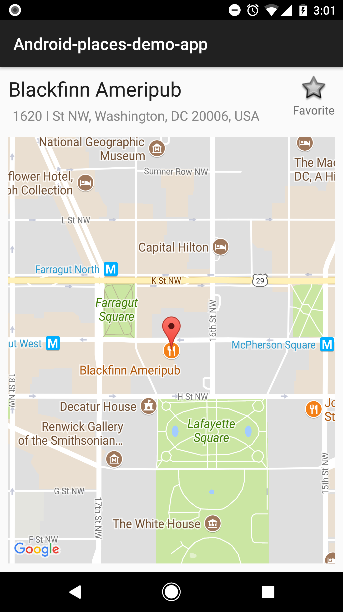

# Android Homework Problem

Note: please spend a __maximum of 2 hours__ on the homework assignment.  It is ok to submit an unfinished solution.

### Summary:

  This project pulls down some google places and displays them in a list.  Please complete the feature requests,
  there may be some bugs or inefficiencies in the code to correct.  Pull in any dependencies that you like.
  You will need to get api keys for Google Maps and Places: https://console.developers.google.com/project
  Search the project for 'YOUR_KEY_HERE' to add them.

### Feature Requests:

  - Create a details view that matches the place details mock provided.  Favoriting a place should be reflected in the list view.

  

  - Provide an empty state for the List View.

### Bonus (if time)

  - Provide ui controls for user to search the list.
  - Provide an alphabetical sort for the list.
  - Prompt for location permission (there is a helper Permission class you can use in the project)

### Submission:

  Once complete, tar and gzip the project directory and email the tarball to your point of contact.
